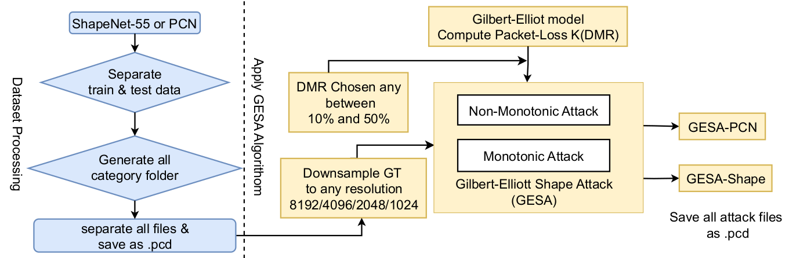

# GESA: Exploring Loss-based Adversarial Attacks in Volumetric Media Streaming

# Overview
  

# Install

To reproduce the results of the paper, please set up the Python environment using the following code:

      git clone https://github.com/husnejahan/GESA-Code.git
      python3 -m venv my-env
      source my-env/bin/activate
      pip3 install -r requirements.txt

# Download datasets
    Fisrt download the ground truth(GT) of PCN and shapeNet55 datasets.

# GESA-PCN

We generated GESA-PCN using randomly generated packet loss 17% (V1), 28% (V2), and 46% (V3).

To downsample in any resolution:

     cd GESA-PCN
     PCDtoPCD.sh

 To apply Gilbert-Elliott Shape Attack(GESA)  
 
     PCDtoAttack.sh

# GESA-Shape

We generated GESA-Shape using randomly generated packet loss 19% (V1), 24% (V2), and 31% (V3). 

To convert as .pcd file and downsample in any resolution:

     cd GESA-Shape
     NPYtoPCD.sh

To apply Gilbert-Elliott Shape Attack(GESA) 

     PCDtoAttack.sh

# Citation

Please cite this paper if you want to use it in your work.
